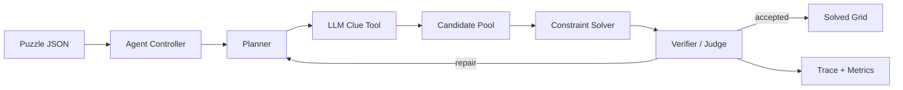

# Forward Deployed Engineer Take-Home Submission

## What This Is

This repository implements a crossword-solving **agent harness**. The agent uses
LLM clue reasoning as one tool, then relies on deterministic verification,
crossing constraints, traces, and evals to decide what to commit.



## How To Run

Mock mode, no API key required:

```bash
python -m venv .venv
source .venv/bin/activate
pip install -r requirements.txt
python scripts/solve.py data/puzzles/mini_001.json --mock
python scripts/evaluate.py --puzzles data/eval --gold data/gold --method agent --mock
```

Real LLM mode:

```bash
set -a
source .env
set +a
python scripts/solve.py data/puzzles/mini_001.json --real
python scripts/evaluate.py --puzzles data/eval --gold data/gold --method agent --real
```

Trace analysis:

```bash
python scripts/analyze_traces.py runs
```

## Design Decisions

- **Agent over one-shot prompt:** the LLM proposes clue candidates; code verifies
  hard constraints.
- **Typed tool boundary:** the clue tool returns strict JSON-schema structured
  outputs, then local Pydantic and crossword-specific validators filter results.
- **Verifier layer:** the solver proposes assignments; the verifier accepts,
  rejects, or recommends repair.
- **Trace-first debugging:** every run writes `trace.jsonl`, `final_solution.json`,
  and `metrics.json`.
- **Bounded self-improvement:** trace analysis suggests prompt, policy, and eval
  changes, but changes are human-approved and eval-gated.

## Evaluation Results

Current eval set: 4 small puzzles, 30 clue slots total. This is still a compact
take-home dataset, not a claim of production crossword accuracy.

| Method | Mode | Cell Acc | Word Acc | Full Puzzle Acc | Avg LLM Calls | Avg Runtime |
| --- | --- | ---: | ---: | ---: | ---: | ---: |
| Agent | mock | 1.000 | 1.000 | 1.000 | 0.0 | 0.001s |
| Independent baseline | mock | 0.944 | 0.833 | 0.500 | 0.0 | n/a |
| Agent | real LLM | 1.000 | 1.000 | 1.000 | 8.0 | 14.53s |

The key signal is not the raw 100 percent score on a small set; it is that the
agent improves over independent clue solving by using crossing constraints and
verification.

## Trade-Offs

- Explicit slot JSON keeps the MVP robust, but a production version should add
  `.puz` or other crossword importers.
- Beam search is explainable and easy to test, but larger puzzles would benefit
  from stronger pruning and dictionary-backed candidates.
- Mock evals are reproducible and cheap, but the real signal requires a larger
  held-out puzzle set.
- Bounded self-improvement is safer than letting the agent edit its own code,
  but it still depends on high-quality evals.

## Follow-Up Discussion Topics

- How to expand the eval set without overfitting.
- How to add `.puz` ingestion.
- How to tune repair policy based on trace analysis.
- How to track exact model pricing and cost budgets.
- How to add human-in-the-loop escalation for low-confidence answers.
