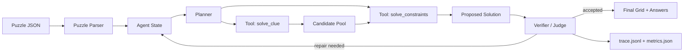
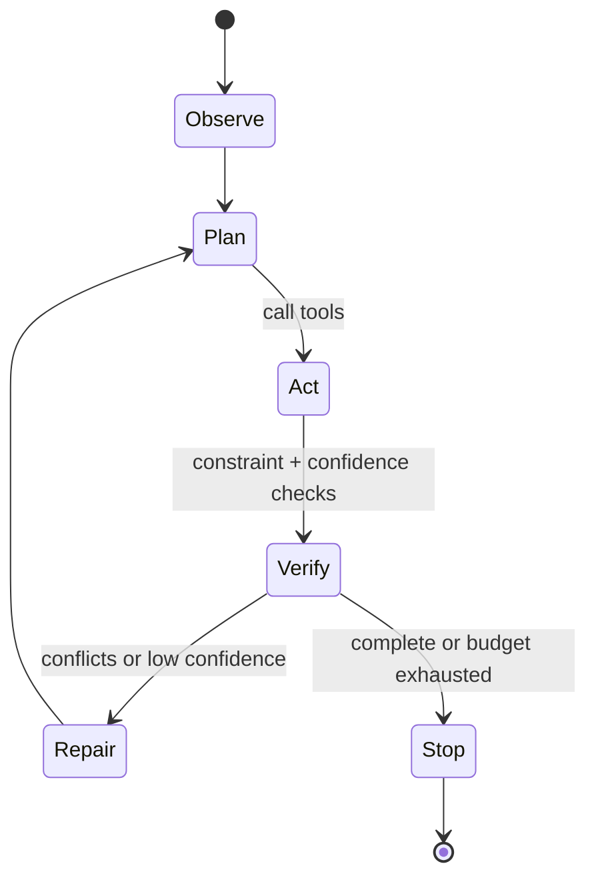
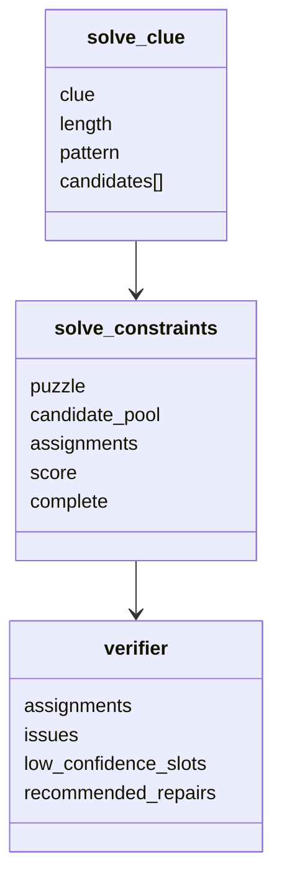
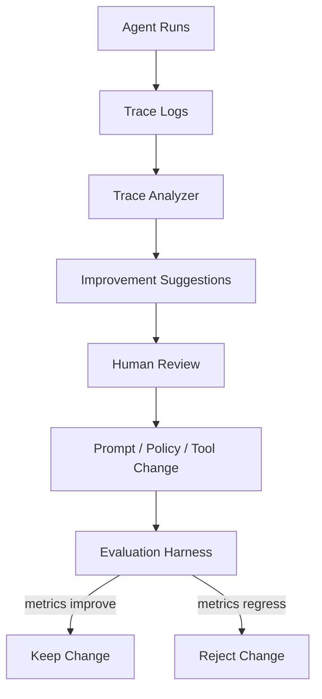
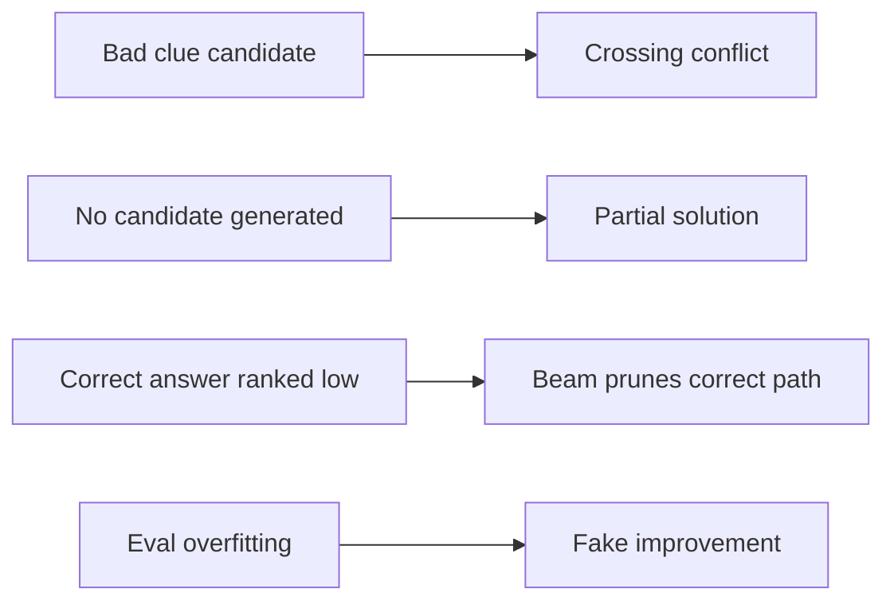

# Crossword Agent Design Discussion

This project is intentionally framed as an **agent harness**, not just a crossword
solver. The crossword domain gives the agent a concrete task with hard
constraints, while the harness makes the behavior inspectable, measurable, and
iterable.

## Summary

The agent combines:

- LLM-style clue reasoning for semantic candidates.
- Deterministic verification for length, pattern, and crossing constraints.
- Beam search for global consistency.
- Trace logs and evaluation metrics for debugging.
- A bounded improvement loop that proposes harness changes from traces but keeps
  humans in the approval path.

## System Architecture



The LLM or mock clue tool proposes answers, but the verifier decides whether a
proposal is allowed to survive. This is the main reliability pattern: **LLM
proposes, verifier disposes**.

## Agent Loop



The loop is deliberately small:

1. Observe puzzle slots and crossings.
2. Plan which clues need candidate generation.
3. Act by calling typed tools.
4. Verify candidate assignments against deterministic constraints.
5. Repair conflicts or low-confidence slots.
6. Stop on completion, cost budget, or round budget.

This is a loop-engineering choice. The agent has autonomy inside a bounded
workflow, but the workflow remains easy to debug.

## Tool Contracts



Each tool has a narrow responsibility:

- `solve_clue`: semantic candidate generation.
- `solve_constraints`: global crossing consistency.
- `validate_grid`: hard correctness checks.
- `evaluate_solution`: gold-set quality measurement.
- `analyze_traces`: bounded improvement recommendations.

This keeps the agent testable. A production version could replace the clue tool
with a better model, a dictionary-backed retriever, or a crossword clue database
without changing the rest of the harness.

## Why Not Just Ask an LLM for the Whole Grid?

Direct LLM solving is attractive because it is simple, but it is brittle:

- It can violate answer lengths.
- It can invent letters that break crossings.
- It gives little insight into which clue caused failure.
- It is hard to evaluate and repair incrementally.

The chosen design uses the model where it is strong, clue semantics, and uses
code where code is stronger, constraints, verification, search, tracing, and
repeatability.

## Design Decisions

### Explicit Puzzle Slots

The current JSON format defines slots directly rather than deriving clue numbers
from a newspaper format. This reduces parser complexity for the MVP and focuses
the assignment on agent behavior.

Trade-off: less realistic ingestion, but a more reliable take-home demo. A
future importer can add `.puz` or web crossword support.

### Beam Search Instead of Pure Backtracking

Beam search lets the agent keep several plausible global assignments without
exploding on every low-quality candidate.

Trade-off: beam search can prune a correct path if the candidate ranking is poor.
For larger puzzles, I would add adaptive beam sizing and slot-order heuristics.

### Mock Mode

Mock mode lets reviewers run the full agent without API keys. It also includes
intentionally misleading high-ranked candidates so the evaluation demonstrates
that the constraint solver improves over independent clue solving.

Trade-off: mock results are not a real crossword benchmark. They are a harness
smoke test.

### Verifier Layer

The verifier is separate from the solver. The solver proposes a best assignment;
the verifier judges whether it should be accepted, repaired, or returned as a
partial result.

Trade-off: this is slightly more code, but it maps well to production agent
systems where policy, validation, and execution should be separated.

### Strict Structured Outputs

The real LLM clue tool requests strict JSON-schema output from the model:

```text
CandidateResponse
  candidates[]
    answer: string
    confidence: number
    rationale: string
```

The schema constrains the model response shape, then local Pydantic validation
rejects malformed objects or extra fields, and the crossword filter enforces
domain constraints such as length, uppercase letters, known pattern, and
deduplication.

Trade-off: API-level schema enforcement improves reliability, but business rules
still need local validation because they are domain-specific and should not rely
only on prompt compliance.

### Bounded Self-Improvement

The project does not let the agent edit its own code. Instead, it provides
`scripts/analyze_traces.py`, which reads run traces and proposes improvements for
a human to approve.

The analyzer now emits three classes of recommendations:

- **Prompt recommendations:** slots with too few candidates, low top-answer
  margin, empty candidate lists, or repeated low-confidence verification.
- **Policy recommendations:** changes to commitment, repair, or slot ordering
  behavior, such as deferring low-margin answers to crossings.
- **Evaluation recommendations:** whether the traces are sufficient to trust a
  change and which metrics must not regress.

This is a safer and more realistic version of self-improvement:



The important rule is: **the agent can recommend harness changes, but evals gate
whether they are accepted**.

## Evaluation Methodology

The project measures both correctness and operational behavior.

Correctness metrics:

- Cell accuracy
- Word accuracy
- Full-puzzle solve rate

Operational metrics:

- Tool calls
- LLM calls
- Estimated cost
- Wall-clock runtime
- Completion status

Baselines:

- `independent`: solve each clue independently, ignore crossings.
- `agent`: use clue candidates plus crossing constraints and verification.

Current evaluation:

```text
agent, mock:
  cell_accuracy: 1.0
  word_accuracy: 1.0
  full_puzzle_accuracy: 1.0

independent baseline, mock:
  cell_accuracy: 0.9444
  word_accuracy: 0.8333
  full_puzzle_accuracy: 0.5

agent, real LLM:
  cell_accuracy: 1.0
  word_accuracy: 1.0
  full_puzzle_accuracy: 1.0
  avg_llm_calls: 8.0
  avg_wall_time_seconds: 14.53
```

The mock dataset is small, so I would not present this as a claim of real-world
crossword performance. I would present it as evidence that the harness catches
candidate-generation errors and uses structure to improve over a weaker policy.

## Failure Modes



Main mitigations:

- Generate multiple candidates per clue.
- Re-query with known patterns after conflicts.
- Keep trace logs for failure analysis.
- Use held-out puzzles for evaluation.
- Keep humans in the loop for harness changes.

## Enterprise Agent Concepts Used Carefully

### Harness Engineering

The harness is the system around the model: state, tools, policies, trace logs,
config, budgets, and evals. This project makes that harness explicit.

### Loop Engineering

The agent loop is designed, not improvised. Stop conditions, repair conditions,
and verification conditions are part of the product.

### Judge / Evaluator / Verifier

The verifier layer checks whether tool outputs should be accepted. It is separate
from both the candidate generator and the solver.

### Bounded RSI

The project includes a trace-driven improvement loop, but it avoids full
autonomous self-modification. That keeps the system useful without turning the
take-home into a speculative safety demo.

## What I Would Improve Next

1. Add `.puz` import support and a larger public-domain evaluation set.
2. Add a crossword dictionary or clue database for better non-LLM candidates.
3. Track token usage and model pricing more accurately by model.
4. Add interactive human-in-the-loop repair for low-confidence entries.
5. Add hidden eval sets to prevent overfitting the mock dataset.
6. Add richer trace visualization for the one-minute demo.

## Interview Talking Points

- I separated semantic proposal from deterministic verification.
- I chose an agent harness over a single prompt because reliability and
  debuggability matter in deployed systems.
- I added baselines to show the value of orchestration, not just the model.
- I avoided unbounded self-improvement because eval quality is the bottleneck.
- I used mock mode so the project is runnable by any reviewer, then left a path
  to real LLM mode through the same tool contract.
